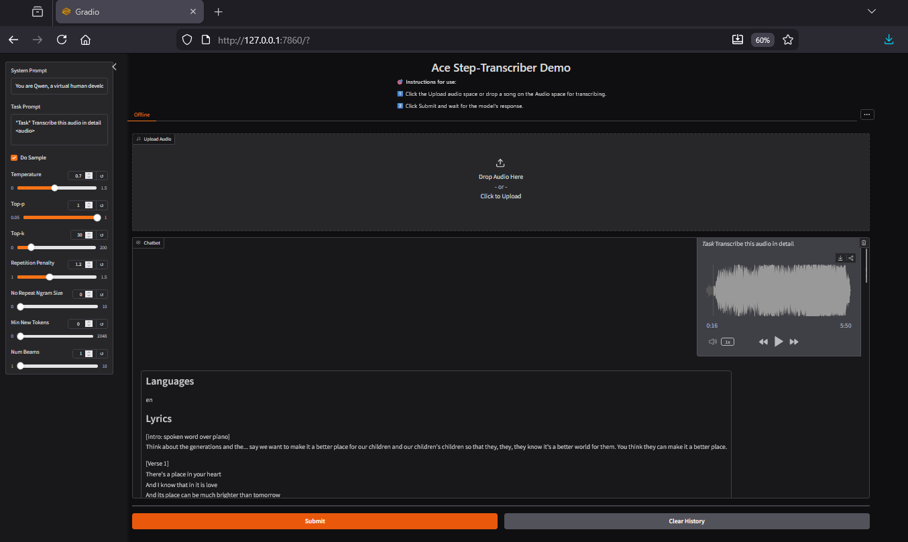

# Song Transcriber Demo using Ace-Step’s Qwen2.5-Omni–based Transcription Model

A fork of the Alibaba **Qwen2.5-Omni** repository that can make use of the **Ace-Step song lyrics transcription model**  
[`ACE-Step/acestep-transcriber`](https://huggingface.co/ACE-Step/acestep-transcriber) hosted on Hugging Face.

<p align="center">
  
</p>


To run this demo successfully, you need:

- **NVIDIA Ampere+ class GPU with at least ~12 GB of available VRAM**
- One of these memory strategies:
  - **FlashAttention 2** (enabled by default in `transcribe_demo.py`) for flat VRAM usage.
  - **BitsAndBytes 4-bit quantization** (`--bnb-4bit`) for the lowest VRAM usage, with mild degradation on longer songs.

**GPU Recommendations**
- 12 GB class (RTX 3080, 4070 Ti, 5070): Flash Attention2 + BitsAndBytes ✅(expect mild degradation).
- 16 GB class (RTX 4080, 4080 Ti, 5080): Flash Attention2 + BitsAndBytes ✅(expect mild degradation).
- 24 GB class (RTX 3090, 4090, 5080 Ti): Flash Attention2 ✅.
- 32 GB class (RTX 5090): Flash Attention2 ✅, Don't enable BitsAndBytes unless batching.


---

## Contents <!-- omit in toc -->

- [Overview](#overview)
  - [Introduction](#introduction)
  - [Key Features](#key-features)
  - [Model Architecture](#model-architecture)
  - [Performance](#performance)
- [Quickstart](#quickstart)
  - [Linux](#linux)
  - [Windows (CMD)](#windows-cmd)
  - [Flash-Attention 2 Installation](#flash-attention-2-installation)
- [Launch Local Web UI Demo](#launch-local-web-ui-demo)
- [Citation](#citation)

---

## Overview

### Introduction

Ace-Step and StepFun trained a **Qwen2.5-Omni–based model** to listen to songs and transcribe sung vocals.  
While it is not perfect, it provides a **significant speed boost** when building lyric datasets, producing mostly correct lyric transcriptions with basic arrangement annotations.

This repository modifies the standard Gradio demo and decoding logic so the model can be used for transcription via the Hugging Face *transformers* stack.

The transcription model itself is trained by **Ace-Step and StepFun** and is based on **Qwen2.5-Omni**, an end-to-end multimodal model developed by Alibaba. Qwen2.5-Omni is designed to perceive text, images, audio, and video while simultaneously generating text and natural speech responses in a streaming manner.

<p align="center">
  
</p>

---

### Key Features

- **Song lyric and structure transcription**  
  Upload a song via the Gradio interface and transcribe sung vocals with basic arrangement awareness.

---

### Model Architecture

<p align="center">
  
</p>

---

### Performance

The model supports **19 languages**, though performance varies due to data imbalance.  
The best-performing languages include:

- English
- Chinese
- Russian
- Spanish
- Japanese
- German
- French
- Portuguese
- Italian
- Korean

Uncommon words may be misinterpreted, and audio obstructions (heavy instrumentation, distortion, overlapping vocals) can negatively affect transcription accuracy.

---

#### Memory Strategy Performance

Test setup: single-pass transcription, max reserved VRAM recorded during generation.

| Audio Length | Standard (GB) | BnB 4-bit (GB) | Flash Attn2 (GB) | BnB + Flash Attn2 (GB) |
| --- | --- | --- | --- | --- |
| Model Load Only (0s) | 21.40 | 10.54 | 21.40 | 10.54 |
| 30s | 21.68 | 11.25 | 21.50 | 11.20 |
| 60s | 22.58 | 11.25 | 21.50 | 11.10 |
| 90s | 24.57 | 12.01 | 21.50 | 11.10 |
| 120s | 27.35 | 15.88 | 21.50 | 11.10 |
| 150s | 30.92 | 19.50 | 21.50 | 11.10 |
| 180s | 39.25 | 23.20 | 21.50 | 11.10 |
| 210s | 44.59 | 29.60 | 21.50 | 11.10 |

Notes:
- Memory growth behavior differs by mode. Standard and BnB 4-bit scale with song duration; Flash Attn2 is flat.
- **BitsAndBytes 4-bit introduces some transcription degradation on longer songs** when BnB is enabled, consistent with reduced numerical headroom in attention.

**GPU compatibility conclusions**
- 12 GB class (RTX 3080, 4070 Ti, 5070): Standard ❌, Flash only ⚠️, Both ✅ (expect mild degradation).
- 16 GB class (RTX 4080, 4080 Ti, 5080): Standard ❌, Flash only ⚠️, Both ✅ (expect mild degradation).
- 24 GB class (RTX 3090, 4090, 5080 Ti): Standard ⚠️ (short audio only), Flash Attn2 ✅, BnB optional.
- 32 GB class (RTX 5090): Standard ✅ up to ~150s, Flash Attn2 ✅ for longer audio, BnB optional unless batching.

Flash Attention2 is enabled by default.
If you want to use BitsandBytes 4-bit Quantization, you must install the latest BitsAndBytes wheel with no deps, and then use the
```cmd 
--bnb-4bit
```
command-line flag.

If you forget the nodeps part of the command, BitsandBytes will try and upgrade your Torch version which will install incompatible libraries.

Windows:
```cmd
python -m pip install --no-deps https://github.com/bitsandbytes-foundation/bitsandbytes/releases/download/continuous-release_main/bitsandbytes-1.33.7.preview-py3-none-win_amd64.whl
```

Linux:
```bash 
python3 -m pip install --no-deps https://github.com/bitsandbytes-foundation/bitsandbytes/releases/download/continuous-release_main/bitsandbytes-1.33.7.preview-py3-none-manylinux_2_24_x86_64.whl
```

---

## Quickstart

Make sure you have **Python 3.10, 3.11, or 3.12** installed and available in your `PATH`.

---

### Linux

```bash
git clone https://github.com/Teravus/TranscriberModelDemo.git
cd TranscriberModelDemo
```

Create and activate a virtual environment:
```bash
python3 -m venv venv
source venv/bin/activate
```

Install dependencies:
```bash
python3 -m pip install -r requirements.txt
python3 -m pip install -U flash-attn --no-build-isolation
```

Download the Ace-Step transcription model from Hugging Face:
```bash
huggingface-cli download Ace-Step/acestep-transcriber --local-dir ./acestep-transcriber
```

Start the Gradio demo:
```bash
python3 transcribe_demo.py -c ./acestep-transcriber
```

---

### Windows (CMD)

Make sure you have **Python 3.10, 3.11, or 3.12** installed from python.org and that **“Add Python to PATH”** was checked during installation.

Also, make sure to download ffmpeg and put a copy of it in your path. <a href="https://www.ffmpeg.org/download.html#build-windows">Windows FFMPEG Downloads</a>

Open **Command Prompt (cmd.exe)** and run:

```cmd
git clone https://github.com/Teravus/TranscriberModelDemo.git
cd TranscriberModelDemo
```

Create the virtual environment:
```cmd
python -m venv venv
```

Activate the virtual environment:
```cmd
call venv\Scripts\activate
```

Install dependencies:
```cmd
python -m pip install --upgrade pip
python -m pip install -r requirements.txt
```

Download the Ace-Step transcription model:
```cmd
huggingface-cli download Ace-Step/acestep-transcriber --local-dir .\acestep-transcriber
```

Install Flash Attention (See below)

Start the Gradio demo:
```cmd
python transcribe_demo.py -c .\acestep-transcriber
```

Remember to reactivate the virtual environment if you close the cmd window or use the deactivate command before trying to load the demo again.
From within the TranscriberModelDemo folder, Activate the virtual environment:
```cmd
call venv\Scripts\activate
```

---

### Flash-Attention 2 Installation

#### Linux

```bash
pip install -U flash-attn --no-build-isolation
```

#### Windows

Building FlashAttention on Windows can be challenging. If that is the case, you may choose to install a **prebuilt wheel**.

Prebuilt Windows wheels are available here (I have tested a few of these, but since they're third party, use at your own risk):  
https://github.com/kingbri1/flash-attention/releases

⚠️ **Important:**  
The FlashAttention wheel **must match** your:
- Python version
- Torch version
- CUDA version

This repository installs **Torch 2.7 with CUDA 12.8**, so you only need to select the wheel that matches your Python version:

- **Python 3.10**  
  `flash_attn-2.8.3+cu128torch2.7.0cxx11abiFALSE-cp310-cp310-win_amd64.whl`
- **Python 3.11**  
  `flash_attn-2.8.3+cu128torch2.7.0cxx11abiFALSE-cp311-cp311-win_amd64.whl`
- **Python 3.12**  
  `flash_attn-2.8.3+cu128torch2.7.0cxx11abiFALSE-cp312-cp312-win_amd64.whl`

Once you download it to your TranscriberModelDemo folder, you install it with 
```cmd
python -m pip install <downloaded wheel file>
```
Example:
```cmd
python -m pip install flash_attn-2.8.3+cu128torch2.7.0cxx11abiFALSE-cp310-cp310-win_amd64.whl
```

For hardware compatibility details, see the official documentation:  
https://github.com/Dao-AILab/flash-attention

---

## Launch Local Web UI Demo

After completing the Quickstart steps, start the demo:

```bash
python transcribe_demo.py -c ./acestep-transcriber
```

You should see output similar to:
```
Running on local: http://127.0.0.1:7860/
```

Open the link in your browser to access the web UI, upload audio, and click **Submit** to transcribe.

If you want BitsAndBytes 4bit quantization enabled, you need to use the --bnb-4bit command line argument
```bash
python transcribe_demo.py -c ./acestep-transcriber --bnb-4bit
```

-- 
## Virtual Environment Reactivation 

Remember, if you close the CMD window or use the deactivate command, you'll need to activate the virtual environment again before running the demo.

From within the TranscriberModelDemo folder, Activate the virtual environment:
```cmd
call venv\Scripts\activate
```


---

## Citation

```bibtex
@article{ACE-Step1.5,
  title        = {ACE-Step 1.5: Pushing the Boundaries of Open-Source Music Generation},
  author       = {Junmin Gong and Yulin Song and Wenxiao Zhao and Sen Wang and Shengyuan Xu and Jing Guo},
  journal      = {arXiv preprint arXiv:2602.00744},
  year         = {2026},
  doi          = {10.48550/arXiv.2602.00744},
  eprint       = {2602.00744},
  archivePrefix= {arXiv},
  primaryClass = {cs.SD}
}
```

```bibtex
@article{Qwen2.5-Omni,
  title   = {Qwen2.5-Omni Technical Report},
  author  = {Jin Xu and Zhifang Guo and Jinzheng He and Hangrui Hu and Ting He and Shuai Bai and Keqin Chen and Jialin Wang and Yang Fan and Kai Dang and Bin Zhang and Xiong Wang and Yunfei Chu and Junyang Lin},
  journal = {arXiv preprint arXiv:2503.20215},
  year    = {2025}
}
```

<br>
